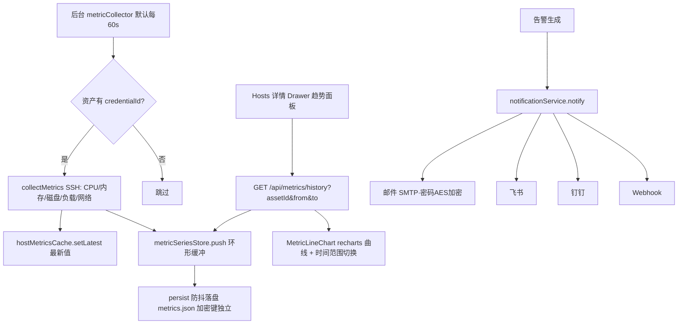
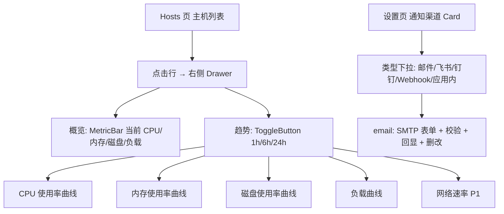

> 本文档由软件团队产品经理许清楚产出（生产级修订版），主理人齐活林落盘归档，作为 `software-ops-nexus` 团队**第一增量**（主机指标时序化 + Hosts 趋势曲线 + 邮件通知 SMTP）的需求基线。
> 用户硬质量要求（贯穿全阶段）：前端/UI 生产级、设置功能逻辑无问题（保存/回显/校验/失败处理/字段对齐都要可测验收）、全维度（功能/UI-UX/安全/性能/可维护）、只要最好的——宁收敛精做不粗制滥造。
> 主理人对 PRD「待确认问题」的决策见下方「主理人决策」，架构师与工程师须据此落地。

---

# 简单 PRD（生产级修订版）· ops-platform 第一增量：主机指标时序化 + 趋势曲线 + 邮件通知（SMTP）

> 项目名：`host_monitoring_timeseries_smtp`
> 语言：中文 ｜ 技术栈：Electron 28 + Vite/React 18 + MUI 5 + Express 4；存储 = `memoryStore` + `persist.ts`（JSON 文件），无数据库、无 Prometheus/Grafana。
> **【硬约束·用户原话】**：「前端页面和 UI 也要好，设置功能逻辑要无问题等全维度考虑，我们只要最好的」。
> 据此本修订版落实：① UI 设计稿达到**可交付生产级**（精确 design-tokens、视觉规范、交互细节）；② 设置页（含新增邮件 SMTP）给**可测验收用例**；③ 需求池覆盖**功能/UI-UX/安全/性能/可维护性**全维度；④ 基调**只要最好**——宁可收敛范围、分批交付，也不粗制滥造；任一经不住质量门禁（DoD）的交付物一律拆到下一增量，不半吊子上线。
> 本 PRD 仅做需求分析，不含代码。所有文件路径均基于已读源码（`hostMetricsCache` / `sshService` / `notificationService` / `Settings` / `Hosts` / `memoryStore` / `persist` / `types` / `bus` / `index` / `App`）。

---

## 1. 产品目标
**一句话**：在不引入数据库与重型监控栈的前提下，把 ops-platform 从「只看最新值」升级为「生产级可回看历史趋势」，并补齐与现有渠道同质的邮件（SMTP）告警通道，对标 NexusOps 监控栈与通知渠道的可用性——且前端 UI 与设置逻辑必须达到可交付质量。

**价值点**：
1. 主机指标从「瞬时快照」变为「可回看的时序曲线」，运维可快速定位 CPU/内存/磁盘/负载劣化拐点。
2. 告警渠道补齐邮件（SMTP），覆盖无 IM 机器人环境，与 Webhook/飞书/钉钉统一触达、统一质量。
3. 复用 `memoryStore` + `persist.ts`「内存 + JSON」机制，零新增原生依赖、零部署门槛，符合单机桌面定位。
4. 为后续 Grafana 式大盘、DB/K8s 时序化、智能 SRE 编排预留统一、可控体积的时序底座。

---

## 2. 用户故事
- 作为**运维工程师**，我希望在主机详情看到 CPU/内存/磁盘的 1h/6h/24h 趋势曲线，以便判断是缓慢劣化而非偶发抖动。
- 作为**运维工程师**，我希望新增主机后自动周期采集并落盘历史，无需每次手动点「采集指标」。
- 作为**值班人员**，我希望告警能发到邮箱（SMTP），以便无 IM 机器人环境也能收到通知。
- 作为**运维负责人**，我希望历史指标重启不丢、文件体积可控，长期使用不撑爆磁盘。
- 作为**前端维护者**，我希望趋势图与设置页是**生产级、契合 design-tokens 深色主题**的成品，而非草图，且不引入笨重依赖。
- 作为**使用者**，我希望设置页（含邮件 SMTP）的每个开关/表单/增删改都**保存可靠、回显准确、校验严谨、失败有提示**，绝不留字段对不上的半吊子实现。

---

## 3. 需求池

### 3.1 P0（本增量必做，生产级）
| 能力 | 验收标准（功能） | 影响文件（预估） |
|---|---|---|
| 轻量时序存储（环形缓冲） | 新增 `metricSeriesStore`：`Map<assetId, HostMetricSample[]>` 环形缓冲；`push` 追加并裁剪至 `MAX_POINTS`；`query(assetId,from,to)` 按 ISO 范围返回；`getLatest` 兜底 `hostMetricsCache`；CPU/内存/磁盘/负载自动写入 | 新增 `src/server/store/metricSeriesStore.ts` |
| 时序持久化（独立文件） | 复用 `persist.ts`「原子写+400ms 防抖」新增通用写入器，落盘 `metrics.json`（**不并入 store.json**，避免主存储膨胀）；启动加载 | 修改 `src/server/store/persist.ts` |
| 采集即写时序 | `sshService.collectMetrics` 在 `setLatest` 后调 `metricSeriesStore.push` | 修改 `src/server/services/sshService.ts` |
| 周期自动采集 | 新增后台任务（挂 `startBackgroundJobs`）默认每 60s 遍历有 `credentialId` 资产调 collectMetrics；限并发/SSH 超时/无凭据跳过；复用 `/api/ssh/collect` 的「凭据解析+collectMetrics」路径（抽 `collectAsset(assetId)` 共享函数）；不阻塞总线 | 新增 `src/server/services/metricCollector.ts`；改 `src/server/index.ts` |
| 指标历史查询接口 | `GET /api/metrics/history?assetId&from&to` 返回范围内样本（>200 点按时间桶降采样）；遵循 `{code,data,message}` 信封 | 新增 `src/server/routes/metrics.ts`；改 `index.ts` |
| 前端查询客户端 | `api.metrics.history({assetId,from,to})` 类型化 | 改 `src/capabilities/bus.ts` |
| 主机详情趋势面板（生产级 UI） | Hosts 页新增「详情」入口，右侧 Drawer 展示 CPU/内存/磁盘/负载曲线 + 时间范围切换（1h/6h/24h，默认 24h）；缺数据显「暂无数据」；加载/空/错误态齐备；严格对齐 design-tokens | 改 `src/renderer/pages/Hosts.tsx` |
| 轻量曲线组件 | **依赖 recharts（主理人已批准）** 实现 SVG 折线图（主题色、tooltip、阈值描点、十字光标），不引入 Grafana | 新增 `src/renderer/components/MetricLineChart.tsx` |
| 邮件（SMTP）类型 | `NotificationChannelType` 增 `'email'`；`Settings.tsx` 下拉含「邮件」并切换 SMTP 表单；`notify` 对 email 走 SMTP | 改 `src/shared/types.ts`、`Settings.tsx`、`notificationService.ts` |
| 邮件发送实现 | 复用 `buildText(alert)` 经 SMTP 发出；失败仅记日志、不阻断告警落库；列表脱敏密码 | 改 `notificationService.ts`（引入 nodemailer） |
| **SMTP 密码加密存储（安全 P0）** | 邮件密码经现有 `crypto.ts`（AES-256-GCM，同 `ops-key.json` 密钥）加密落盘；列表接口剥离 `smtpPassword`；与凭据体系一致，杜绝明文 | 改 `notificationService.ts`、`memoryStore.ts`（类型） |
| **webhook secret 加密（安全，纳入）** | webhook/飞书/钉钉的 `secret` 同样经 `crypto.ts` 加密落盘、列表脱敏，与邮件密码同体系 | 改 `notificationService.ts`、`credentialService.ts` 相关 |

### 3.2 P1（本增量内增强，可排期；脆弱则拆到增量 2）
| 能力 | 验收标准 | 影响文件 |
|---|---|---|
| 网络指标采集 | `collectMetrics` 增网络采集（`/proc/net/dev` 取 rx/tx 字节，相邻样本算速率），`HostMetricSample` 增 `network?`；趋势面板展示网络速率（有数据才显示） | `sshService.ts`、`types.ts`、`Hosts.tsx` |
| 自定义时间范围 | 趋势面板除 1h/6h/24h 外支持自定义起止 | `Hosts.tsx` |
| 邮件 HTML 模板（可选） | 提供基础 HTML 模板（标题/级别色块/指标摘要），纯文本为后备 | `notificationService.ts` |

### 3.3 P2（明确不做，留后续）
- 独立「监控」大盘页（多主机聚合/同屏对比）
- 数据库 / K8s 指标时序化
- 告警历史趋势图、多收件人分组/值班
- Prometheus 远程写 / Grafana 对接（需时再接）

### 3.4 全维度非功能需求（安全 / 性能 / 可维护性）— 验收门槛
| 维度 | 要求与可测验收 |
|---|---|
| **安全** | ① 邮件密码 **及** webhook secret 加密存储（AES-256-GCM），列表/前端永不见明文（验收：直接读 `store.json` 仅见密文）。② 所有写接口（POST/PUT/DELETE 通知渠道）受 `requireWriteToken` 保护（已落地，本增量不退化）。③ 邮件发送失败不回吐密码到日志。 |
| **性能** | ① 时序查询 O(n) 过滤 + >200 点降采样，单请求 payload ≤ ~50KB。② `metrics.json` 独立、400ms 防抖，单资产环形缓冲 ≤ 10080 点、文件 ≤ 20MB（超限启动告警并截断最旧）。③ 图表（recharts）≤ ~200 点渲染，切换时间范围仅重查该面板、不触发整页重渲染（memo）。④ 采集任务并发 ≤ 5、SSH 超时 10s、间隔 60s，不阻塞 Express 总线（压测：100 资产采集时 `/api/health` 仍 <200ms）。 |
| **可维护性** | ① 采集逻辑抽 `collectAsset(assetId)` 单一真源，路由与采集器共用。② `HostMetricSample`/`NotificationChannel` 类型在 `types.ts` 单一真源；前端 `bus.ts` 类型化客户端。③ 时序持久化复用 `persist.ts` 机制，不另起一套 IO。④ 新增依赖 `recharts`/`nodemailer` 须在 `package.json` 注释体积影响。 |

---

## 4. UI 设计稿（生产级 · 精确 design-tokens）

**设计令牌（已接入 MUI theme，必须引用 `theme.palette.*`，禁硬编码色值）**
- 主色 `#3D7BFF`（`primary.main`）；成功 `#34D399`（`success.main`）；警告 `#F59E0B`（`warning.main`）；危险 `#F87171`（`error.main`）；进行中 `#22D3EE`。
- 深色背景 `#0B0E14`；面板 `#141923`；圆角 8px；分隔线 `divider`。
- 字体 Inter + Noto Sans SC；数值 JetBrains Mono + `tabular-nums` 右对齐。
- 图标 `@mui/icons-material` outlined（16/20/24）；深色默认主题。

### 4.1 趋势曲线面板（Hosts 详情 Drawer）
- **容器**：右侧 `Drawer`，`anchor="right"`，宽度 `min(560px, 92vw)`，全高，背景 `#141923`，滚动可滚；保留主机列表可见便于对照。
- **头部**：主机名（`h6` fontWeight 700）+ 在线 `Chip`（outline，`success`）+「刷新」`IconButton`（重采集并刷新序列尾）+ 关闭 `IconButton`。
- **时间范围**：`ToggleButtonGroup`【1h | 6h | 24h】，默认 24h，选中态 `primary` 实底；切换即重查。
- **概览区**：2 列 `Grid`，复用现有 `MetricBar` 展示当前 CPU/内存/磁盘/负载（最新值），色阶：≥90 危险 / ≥75 警告 / 其余成功。
- **趋势区**：每指标一张 `Paper`（p:2，borderRadius 8，border 1px `divider`，bg `#141923`）：
  - 标题行：指标名（`body2` 600）+ 当前值（JetBrains Mono，`tabular-nums`，按色阶着色）。
  - 图表区：高度 140px 的 `MetricLineChart`（recharts）。曲线 `primary.main`；≥90 区段点/描边 `error.main`、≥75 `warning.main`；栅格用 `divider` 低透明；可选主色低透明面积填充。
  - 指标：CPU 使用率%（100−cpuIdle）、内存使用率%（memUsed/total）、磁盘使用率%（最大挂载 usedPct）、系统负载（load1）。
- **状态齐备**：加载→`CircularProgress` 居中；空历史→图标 + 「暂无数据」（`text.secondary`）；错误→`Alert` severity=error 且不破图。
- **交互**：打开即 `api.metrics.history({assetId, from, to})`；范围切换重算 from/to 重查；hover 显示最近点 tooltip（时间戳 + 值）；「刷新」触发 collect 后重查。
- **响应式**：窄屏 Drawer 转全宽、趋势卡竖排。

### 4.2 设置页 · 通知渠道 + 邮件（SMTP）类型（生产级）
- **链路**：现有「通知渠道」`Card` 内，类型 `MenuItem` 增「邮件」并同步 `TYPE_LABEL`。
- **表单按类型切换**（同一表单区，字段随类型变化）：
  - `email`：名称(必填) + SMTP 主机(必填) + 端口(默认 465/587，`TextField` type=number) + 加密 `Switch`(SSL/TLS ↔ STARTTLS) + 用户名(必填) + 密码(必填, `type=password`) + 发件人(可选, 默认=用户名) + 收件人(必填, 逗号分隔) + 启用 `Switch`(默认开)。
  - `inapp`：仅名称 + 启用（隐藏 url/secret）。
  - `webhook/feishu/dingtalk`：名称 + url(必填) + 签名密钥(可选) + 启用（维持现状）。
- **校验（前端 + 语义）**：email 缺 主机/用户名/密码/收件人 → 内联错误并阻止提交，不发请求；收件人为空或格式错（无 `@`）→ 报错；端口非数字 → 报错。
- **回显**：编辑已有 email 渠道 → 表单预填除密码外所有字段；密码留空=保留原密码，填入=替换（与现有 `secret` 留空保留逻辑一致）。
- **失败处理**：后端 `code!=0`（如 SMTP 配置非法）→ `Alert` severity=error 展示 `message`，**不创建/不更新**，列表保持原状；网络/超时同处理。
- **开关**：`Switch` 切换乐观更新 UI，随即 `PUT enabled` 并 `re-list` 校准，避免状态漂移。
- **删除**：确认对话框 → `DELETE` → `re-list`；删除后告警不再推送该渠道。
- **字段对齐（杜绝对不上）**：表单字段 1:1 映射 `NotificationChannel` 扁平字段 `smtpHost/smtpPort/smtpSecure/smtpUser/smtpPassword/smtpFrom/smtpTo`；列表接口返回须 `mask()` 剥离 `smtpPassword`（与现有 `secret` 处理一致）；无孤儿/多余字段。

### 4.3 设置页验收用例（可测，P0 门禁）
- **AC-S1 新增邮件（合法）**：填全合法字段保存 → 列表出现该渠道，`Chip` 标「邮件」，开关默认开；后端落库。
- **AC-S2 邮件校验（非法）**：缺主机/用户名/密码/收件人任一 → 内联错误、无请求、无新行。
- **AC-S3 编辑回显/密码保留**：编辑 email 渠道 → 预填正确；密码留空保存 → 原密码保留、配置其余更新；填新密码 → 替换且落库为密文。
- **AC-S4 开关联动**：关闭渠道 → 后端 `enabled=false`；后续 `notify` 跳过；其他配置不丢。
- **AC-S5 删除**：确认后删除 → 列表移除、重启后不出现、告警不再推送。
- **AC-S6 字段对齐**：列表返回 JSON 与表单字段完全一致，无 `smtpPassword` 明文；多填/少填字段均被拒绝。
- **AC-S7 失败不污染**：后端返回 `code!=0` → 显示错误 Alert，渠道未变更，原列表保留。
- **AC-S8 回显及时**：保存/切换后 `re-list`，下一帧即反映，无陈旧缓存。
- **AC-S9 其他类型不受影响**：webhook/飞书/钉钉/应用内 增删改校验与之前一致。
- **AC-S10 持久化**：配置 email 后重启应用，从 `store.json` 恢复（密码为密文），设置页正确回显且可继续推送。

### 4.4 数据流 & 页面结构（Mermaid）

---

## 5. 质量门禁 / Definition of Done（全维度，不达标即拆下一批）
任一本增量交付物须全部满足方可上线：
- **功能正确**：指标自动周期采集并落盘；历史查询按范围正确返回；邮件告警真发出；设置增删改全部 AC-S1~S10 通过。
- **UI/UX 生产级**：趋势 Drawer 与设置页 100% 对齐 design-tokens（主色/状态色/圆角/字体/图标），加载/空/错误态齐备，交互无破图、无错位。
- **安全**：邮件密码 **及** webhook secret 密文落盘、列表脱敏；写接口受令牌保护；无密钥泄漏到日志。
- **性能**：历史查询/图表渲染不卡顿（降采样 + memo）；采集任务不阻塞总线；`metrics.json` ≤ 20MB。
- **可维护性**：类型单一真源、采集逻辑共用、持久化复用现有机制、新增依赖留痕。
> **收敛原则**：若网络采集（P1）因 OS 差异脆弱，则拆到「增量 2」，不阻塞增量 1 上线；图表已批准用 recharts（主理人决策），以达到「最好」交互体验。

---

## 6. 主理人决策（待确认问题解答）
1. **采集间隔/留存**：默认 60s、留存 24h（1440 点），本期不做可调，保持简单；7d 留存留增量 2。
2. **图表方案**：**批准引入 recharts**（用户质量要求「最好」，体积 ~110KB gz 桌面应用可接受），用它实现趋势曲线（十字光标/tooltip/zoom），替代原"免费 SVG"方案。
3. **SMTP 依赖**：**批准引入 nodemailer**（纯 JS、无原生编译）。
4. **网络指标**：纳入本期 P1 实现；若因 OS 差异脆弱则拆到增量 2，不阻塞增量 1。
5. **邮件内容**：本期纯文本（复用 buildText），HTML 模板留 P1 可选不阻塞。
6. **端点命名**：以 `/api/metrics/history` 为准，回头修订 `Spec.md` 对齐（消除与旧称 `/api/hosts/:id/metrics` 的偏差）。
7. **webhook secret 加密**：**纳入本增量安全**（低成本，符合全维度），与邮件密码同体系 AES-256-GCM 加密。

---

## 7. 本增量 vs 后续（防范围蔓延 + 分批策略）
- **本增量（增量 1）**：主机指标时序化（CPU/内存/磁盘/负载，网络 P1）+ 周期自动采集 + 历史查询接口 + Hosts 生产级趋势 Drawer（recharts）+ 邮件（SMTP）通知（**密码加密 P0**）+ webhook secret 加密 + 设置页全量可测验收。
- **后续增量 2**：网络指标固化、自定义时间范围、邮件 HTML 模板、独立监控大盘、DB/K8s 时序化。
- **更远**：告警趋势、多收件人分组/值班、Prometheus/Grafana 对接、RBAC、报告 PDF（见《NexusOps扩展蓝图》P1/P2）。

---
附：关键现状事实（已读源码坐实）
- `hostMetricsCache.ts` 仅最新值无历史；`sshService.collectMetrics` 已采 CPU/内存/磁盘/负载并 `setLatest`；指标目前**仅手动点「采集指标」时产生**，故必须新增 `metricCollector` 才能形成历史。
- `NotificationChannelType = webhook|feishu|dingtalk|inapp`；`notificationService.notify` 已向所有启用渠道（非 inapp）推送；新增 `email` 仅在类型枚举 + 发送分支 + Settings 表单三处落地。
- 存储为 `store.json` 整库 JSON + 400ms 防抖；时序若并入会膨胀主文件，故主张独立 `metrics.json` 复用同一机制。
- 凭据加密已用 `crypto.ts` AES-256-GCM（`ops-key.json` 密钥），邮件密码/webhook secret 加密直接复用该体系，与「全维度安全」一致。
