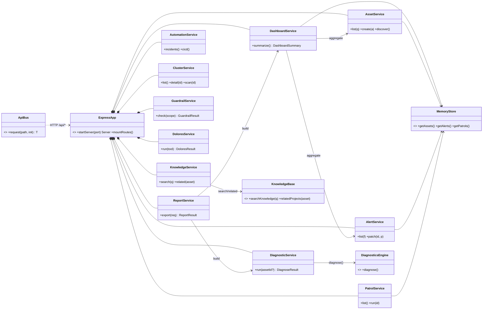
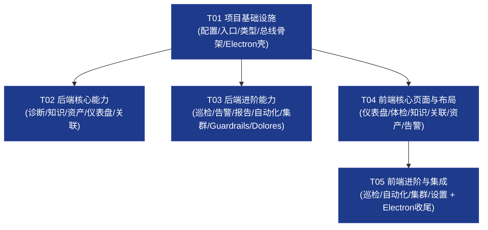

> ⚠️ **DEPRECATED（已过时）**：本文件与当前代码实现存在较大偏差（light 主题 / emoji 状态 / 无 ssh·db·cloud / 计划中的 router.tsx·appStore 均未落地），已不再是单一真源。当前以 **`docs/Spec.md`** 为活跃规范；一切以代码为准。历史审查见 `docs/全维度检查与理解报告.md`、修复见 `docs/修复实施记录.md`。
>

# 企业级运维服务器全维度管理平台 — 系统架构设计 + 任务分解

> 架构师：高见远（Bob）｜ 形态：Electron 桌面壳 + Vite 本地预览 + Node/Express 能力总线 + React 前端
> 范围：P0 全量 + P1 主力实现；P2 留接口/占位
> 配套图：类图 `docs/class-diagram.mermaid`、时序图 `docs/sequence-diagram.mermaid`

---

## Part A：系统设计

### 1. 实现方案与框架选型

#### 1.1 三方关系（已确认基线，不推翻）

| 角色 | 技术 | 职责 |
|------|------|------|
| **能力总线** | Node + **Express**（端口 8787） | 所有 8 大运维技能逻辑在后端执行（诊断需 `exec` 系统命令，浏览器做不到），通过 REST API 暴露。代码放 `src/server/`。 |
| **前端** | **React 18 + TypeScript + Vite + MUI + Tailwind** | 统一通过 `fetch('/api/...')`（相对同源路径）调用后端。代码放 `src/renderer/`。 |
| **桌面壳** | **Electron 28**（仅打包壳） | 主进程 `src/main/main.ts` 启动 Express 服务并 `loadURL('http://localhost:8787')`；预览时直接用 Vite dev server + 浏览器，无需 GUI。 |

#### 1.2 进程模型与预览/打包方式（关键）

- **预览（开发）模式**：不启动 Electron GUI。
  - `npm run dev` = `concurrently` 并行启动 ① Vite dev server（5173）② Express（8787，用 `tsx` 直接跑 TS）。
  - 浏览器打开 `http://localhost:5173`，前端 `fetch('/api/...')` 经 Vite `server.proxy` 把 `/api` 转发到 `http://localhost:8787`，**同源语义、无 CORS 烦恼**。
- **生产打包模式**：
  - `npm run build` → `vite build` 产出 `dist/`（前端静态文件）。
  - Electron 主进程 `startServer()` 拉起 Express（8787），并 `BrowserWindow.loadURL('http://localhost:8787')`。Express 在 `NODE_ENV=production` 时同时托管 `dist/` 静态资源与 `/api`，**完全同源**。
  - `vite-plugin-electron` 仅在生产构建（`BUILD_ELECTRON=true`）时启用，编译 `main.ts`/`preload.ts`；开发时不启动 GUI。
- **核心复用资产**：`src/diagnostics/engine.ts`（`diagnose()`）、`parsers.mjs`、`knowledge.mjs`（`searchKnowledge`/`relatedProjects`）**原样复用**，仅被后端 Service 调用，不重写逻辑。

#### 1.3 框架选型依据

| 关注点 | 选型 | 理由 |
|--------|------|------|
| HTTP 框架 | Express 4 | 轻、生态成熟、`express.json()`+`cors()` 即满足能力总线 |
| 前端框架 | React 18 + TS | 组件化、类型安全、HMR 快 |
| UI 组件 | MUI 5 + Emotion | 企业风组件齐全，主题 token 可控 |
| 样式 | Tailwind 3 | 与 MUI 互补，布局/状态色统一 |
| 路由 | react-router-dom 6 | 侧边栏多页切换 |
| 状态 | Zustand 4 | 轻量全局状态（资产/告警缓存） |
| 跨进程 | 不依赖 IPC | 改为「前端 → REST → Express」HTTP 模型，Electron 仅做壳 |
| 本地运行 TS 后端 | tsx | 开发期直接跑 `src/server/index.ts`，零编译步骤 |
| 进程编排 | concurrently + wait-on | 并行起 Vite/Express，等待端口就绪 |

#### 1.4 架构原则

- **诊断类全部只读、不修改系统**：`diagnose()` / 巡检执行仅调用标准只读命令；返回值结构化（指标名/当前值/正常范围/状态✅⚠️❌/建议）。
- **能力总线单入口**：前端只认 `/api`，后端按模块拆分 router/service，UI 与底层实现解耦。
- **类型单一真源**：`src/shared/types.ts` 定义所有跨端 DTO，前端 `bus.ts` 与后端 controller 共用；`engine.ts` 内部类型与之结构兼容（不改动现有 engine.ts）。

---

### 2. 完整文件列表（相对路径 + 一句话职责）

```
ops-platform/
├─ package.json                     # 依赖与脚本（新增 express/cors/MUI/Tailwind/tsx 等）
├─ tsconfig.json                    # 前端 TS 配置（含 node 类型，允许导入 .mjs）
├─ tsconfig.node.json               # vite.config 专用配置（不变）
├─ vite.config.ts                   # 【改】补 /api 代理 + 条件启用 electron 插件
├─ tailwind.config.js               # 【新】Tailwind 扫描路径 + 主题色 token
├─ postcss.config.js                # 【新】Tailwind/Autoprefixer 接入
├─ index.html                       # 【改】入口指向 src/renderer/main.tsx（已正确）
├─ .env.example                     # 【新】PORT=8787 等环境变量示例
├─ src/
│  ├─ main/
│  │  ├─ main.ts                    # 【新】Electron 主进程：startServer() + loadURL
│  │  └─ ipc.ts                     # 【新】占位（架构已转 REST，IPC 仅留未来扩展点）
│  ├─ preload/
│  │  └─ preload.ts                 # 【新】最小化 contextBridge（仅暴露版本号占位）
│  ├─ diagnostics/                  # 【复用，不重写】
│  │  ├─ engine.ts                  # 导出 diagnose(): DiagnoseResult（跨平台 CPU/内存/磁盘/uptime）
│  │  ├─ parsers.mjs                # 各平台命令输出纯函数解析（单真源）
│  │  └─ knowledge.mjs              # 导出 searchKnowledge(q) / relatedProjects(asset)
│  ├─ shared/
│  │  ├─ types.ts                   # 【新】跨端 DTO 单一真源（Status/Metric/Asset/Alert…）
│  │  └─ constants.ts               # 【新】API_BASE、状态枚举/颜色、主题 token 常量
│  ├─ server/                       # 【新】Express 能力总线
│  │  ├─ index.ts                   # 入口：startServer(port)，挂载路由 + 生产托管 dist
│  │  ├─ routes/
│  │  │  ├─ assets.ts               # 资产纳管 CRUD + 自动发现
│  │  │  ├─ diagnostics.ts          # POST /diagnostics/run（调 engine.diagnose）
│  │  │  ├─ dashboard.ts            # GET /dashboard 聚合
│  │  │  ├─ knowledge.ts            # GET /knowledge/search
│  │  │  ├─ relations.ts            # GET /relations/:asset
│  │  │  ├─ patrols.ts              # 巡检任务 CRUD + 执行
│  │  │  ├─ alerts.ts               # 告警中心 CRUD + 确认/静默
│  │  │  ├─ reports.ts              # 报告导出（Markdown 优先，PDF 占位）
│  │  │  ├─ automation.ts           # 事故管理 + CI/CD 视图
│  │  │  ├─ clusters.ts             # K8s 集群总览/详情/扫描
│  │  │  ├─ guardrails.ts           # OpenClaw 跨设备巡检 + 发布防呆
│  │  │  └─ dolores.ts              # Dolores 工具箱（health/memory/clean/log/cron）
│  │  ├─ services/
│  │  │  ├─ diagnosticService.ts    # 包 diagnose()，记录历史
│  │  │  ├─ knowledgeService.ts     # 包 searchKnowledge/relatedProjects
│  │  │  ├─ dashboardService.ts     # 聚合资产/告警/巡检
│  │  │  ├─ assetService.ts         # 资产台账 + 自动发现（本机 diagnose 播种）
│  │  │  ├─ patrolService.ts        # 巡检编排 + 合成执行
│  │  │  ├─ alertService.ts         # 告警归并 + 状态流转
│  │  │  ├─ reportService.ts        # 构建 Markdown/PDF 报告
│  │  │  ├─ automationService.ts    # 事故 + CI/CD 占位数据
│  │  │  ├─ clusterService.ts       # K8s 健康/节点/工作负载占位
│  │  │  ├─ guardrailService.ts     # 脱敏/审批/跨设备检查占位
│  │  │  └─ doloresService.ts       # 工具箱执行占位
│  │  └─ store/
│  │     └─ memoryStore.ts          # 【新】进程内内存存储（SQLite 后续替换点）
│  ├─ capabilities/
│  │  └─ bus.ts                     # 【新】前端类型化 REST 封装（fetch('/api/...')）
│  ├─ renderer/                     # 【新】React 前端
│  │  ├─ main.tsx                   # 入口：挂载 App + Theme + Router
│  │  ├─ App.tsx                    # 根布局（Sidebar + TopBar + Outlet）
│  │  ├─ theme.ts                   # MUI 主题（深蓝主色 + 状态色）
│  │  ├─ router.tsx                 # 路由表（9 大页面）
│  │  ├─ components/
│  │  │  ├─ Layout.tsx              # 整体栅格布局
│  │  │  ├─ Sidebar.tsx             # 左侧可折叠主菜单
│  │  │  ├─ TopBar.tsx              # 顶部全局栏（搜索/环境/告警铃铛/用户）
│  │  │  ├─ StatusBadge.tsx         # ✅⚠️❌ 三态胶囊
│  │  │  ├─ MetricCard.tsx          # 诊断指标卡
│  │  │  ├─ HealthRing.tsx          # 健康分环形进度
│  │  │  ├─ KpiCard.tsx             # 仪表盘大数字卡
│  │  │  ├─ DataTable.tsx           # 通用表格
│  │  │  ├─ EmptyState.tsx          # 空态兜底
│  │  │  └─ ExportButton.tsx        # 报告导出按钮
│  │  ├─ pages/
│  │  │  ├─ DashboardPage.tsx       # 态势巡检仪表盘
│  │  │  ├─ DiagnosticsPage.tsx     # 系统全栈体检
│  │  │  ├─ KnowledgePage.tsx       # 知识库现象级检索
│  │  │  ├─ RelationPage.tsx        # 可查资料和相关项目（关联视图）
│  │  │  ├─ AssetsPage.tsx          # 统一资产纳管
│  │  │  ├─ AlertsPage.tsx          # 告警中心
│  │  │  ├─ PatrolPage.tsx          # 多层自动化巡检编排
│  │  │  ├─ AutomationPage.tsx      # 流程自动化/事故管理
│  │  │  ├─ ClusterPage.tsx         # K8s 多智能体集群运维
│  │  │  └─ SettingsPage.tsx        # 设置（连接/数据源/导出/主题）
│  │  ├─ store/
│  │  │  └─ appStore.ts             # Zustand 全局状态
│  │  └─ hooks/
│  │     └─ useApi.ts               # 封装 bus 调用 + loading/error
│  └─ styles/
│     └─ index.css                  # 【新】Tailwind 指令 + 全局基础样式
└─ docs/
   ├─ PLAN.md                       # 旧方案（参考）
   ├─ PRD.md                        # 产品需求（参考）
   ├─ system_design.md              # 本文档
   ├─ class-diagram.mermaid         # 类图
   └─ sequence-diagram.mermaid      # 时序图
```

---

### 3. 数据结构和接口（类图 + 类型 + REST 端点）

#### 3.1 核心 TS 类型（`src/shared/types.ts`，跨端单一真源）

```ts
// 状态枚举（与 engine.ts 的 Status 结构兼容，不改动 engine.ts）
export type Status = 'ok' | 'warn' | 'error' | 'unknown'

// —— 诊断（复用 engine.ts 结构）——
export interface Metric {
  name: string
  value: string
  normal: string
  status: Status
  detail?: string
}
export interface DiagnoseResult {
  platform: string
  host: string
  timestamp: string
  metrics: Metric[]
  suggestions: string[]
}

// —— 资产 ——
export type AssetType = 'server' | 'middleware' | 'container' | 'database' | 'network'
export type AssetSource = 'manual' | 'auto' | 'agent' | 'ssh' | 'api'
export interface Asset {
  id: string
  name: string
  type: AssetType
  host: string
  ip?: string
  source: AssetSource
  tags: string[]
  createdAt: string
  healthScore: number   // 0-100
  status: Status
  lastScanAt?: string
}

// —— 知识检索 / 关联 ——
export interface KnowledgeHit {
  id: string
  title: string
  content: string
  source: string        // 'builtin-faq' | 'remote'
  tags: string[]
  relatedAssets: string[]
}
export interface RelatedProject {
  asset: string
  project: string
  ticket: string
  knowledge: string
  note: string
}

// —— 巡检 ——
export type PatrolLayer = 'basic' | 'middleware' | 'container' | 'log' | 'business'
export type PatrolStatus = 'idle' | 'running' | 'success' | 'failed' | 'scheduled'
export interface PatrolRun {
  id: string
  taskId: string
  startedAt: string
  finishedAt?: string
  status: PatrolStatus
  summary: string
}
export interface PatrolTask {
  id: string
  name: string
  layers: PatrolLayer[]
  cron: string
  enabled: boolean
  status: PatrolStatus
  lastRunAt?: string
  nextRunAt?: string
  history: PatrolRun[]
}

// —— 告警 ——
export type AlertLevel = 'P0' | 'P1' | 'P2' | 'P3'
export type AlertState = 'active' | 'ack' | 'silenced' | 'resolved'
export interface Alert {
  id: string
  level: AlertLevel
  title: string
  assetId?: string
  message: string
  state: AlertState
  createdAt: string
  ackedBy?: string
}

// —— 仪表盘 ——
export interface AssetHealthRow { id: string; name: string; status: Status; healthScore: number }
export interface DashboardSummary {
  totalAssets: number
  healthDistribution: Record<Status, number>
  activeAlerts: number
  patrolsToday: number
  assets: AssetHealthRow[]
  recentAlerts: Alert[]
}

// —— 报告 ——
export interface ReportRequest {
  type: 'diagnose' | 'patrol' | 'dashboard'
  assetId?: string
  format: 'markdown' | 'pdf'
  title?: string
}
export interface ReportResult {
  format: 'markdown' | 'pdf'
  filename: string
  content: string       // markdown 文本；pdf 为占位/base64 dataurl
  generatedAt: string
}

// —— 自动化 / 事故 ——
export type IncidentState = 'open' | 'investigating' | 'resolved' | 'postmortem'
export interface Incident {
  id: string
  title: string
  state: IncidentState
  level: AlertLevel
  assetId?: string
  assignee?: string
  createdAt: string
  updatedAt: string
  relatedKnowledge: string[]
}
export interface CicdPipeline {
  id: string
  name: string
  status: 'success' | 'failed' | 'running' | 'pending'
  lastRunAt?: string
  stage: string
}

// —— K8s 集群 ——
export interface ClusterInfo {
  id: string
  name: string
  endpoint: string
  connected: boolean
  nodeCount: number
  healthScore: number
  status: Status
}
export interface ClusterNode { name: string; ready: boolean; role: string; cpu: string; memory: string }
export interface ClusterWorkload { name: string; namespace: string; kind: string; status: string; replicas: string }
export interface AgentStatus { name: string; role: string; status: Status }
export interface ClusterDetail { cluster: ClusterInfo; nodes: ClusterNode[]; workloads: ClusterWorkload[]; agents: AgentStatus[] }

// —— OpenClaw Guardrails ——
export interface GuardrailCheck {
  id: string
  category: 'desensitize' | 'approval' | 'cross-device'
  target: string
  risk: 'low' | 'medium' | 'high'
  passed: boolean
  message: string
}
export interface GuardrailResult { id: string; scope: string; checkedAt: string; checks: GuardrailCheck[]; riskItems: number; passed: boolean }

// —— Dolores 工具箱 ——
export type DoloresTool = 'health' | 'memory-sync' | 'dir-clean' | 'log' | 'cron'
export interface DoloresResult { tool: DoloresTool; status: Status; logs: string[]; executedAt: string }

// —— API 统一信封 ——
export interface ApiResponse<T> { code: number; data: T; message: string }
export interface ApiError { code: number; message: string; detail?: string }
```

#### 3.2 REST API 端点清单（统一前缀 `/api`，成功 `code:0`）

| 模块 | 方法 | 路径 | 入参 | 返回 |
|------|------|------|------|------|
| 资产 | GET | `/assets?q=&type=` | query | `Asset[]` |
| 资产 | GET | `/assets/:id` | — | `Asset` |
| 资产 | POST | `/assets` | `Partial<Asset>` | `Asset` |
| 资产 | PUT | `/assets/:id` | `Partial<Asset>` | `Asset` |
| 资产 | DELETE | `/assets/:id` | — | `{ok:true}` |
| 资产 | POST | `/assets/discover` | — | `Asset[]`（本机 diagnose 播种） |
| 诊断 | POST | `/diagnostics/run` | `{assetId?}` | `DiagnoseResult` |
| 诊断 | GET | `/diagnostics/history?assetId=` | query | `DiagnoseResult[]` |
| 仪表盘 | GET | `/dashboard` | — | `DashboardSummary` |
| 知识 | GET | `/knowledge/search?q=` | query | `KnowledgeHit[]` |
| 知识 | POST | `/knowledge` | `Partial<KnowledgeHit>` | `KnowledgeHit`（P2 自维护占位） |
| 知识 | GET | `/knowledge/:id` | — | `KnowledgeHit` |
| 关联 | GET | `/relations/:asset` | — | `RelatedProject[]` |
| 关联 | GET | `/relations` | — | `RelatedProject[]` |
| 巡检 | GET | `/patrols` | — | `PatrolTask[]` |
| 巡检 | POST | `/patrols` | `Partial<PatrolTask>` | `PatrolTask` |
| 巡检 | PUT | `/patrols/:id` | `Partial<PatrolTask>` | `PatrolTask` |
| 巡检 | DELETE | `/patrols/:id` | — | `{ok:true}` |
| 巡检 | POST | `/patrols/:id/run` | — | `PatrolRun` |
| 报告 | POST | `/reports/export` | `ReportRequest` | `ReportResult` |
| 报告 | GET | `/reports/:id/download` | — | 文件流（可选） |
| 告警 | GET | `/alerts?level=&state=&assetId=` | query | `Alert[]` |
| 告警 | POST | `/alerts` | `Partial<Alert>` | `Alert` |
| 告警 | PATCH | `/alerts/:id` | `{state}` | `Alert` |
| 告警 | DELETE | `/alerts/:id` | — | `{ok:true}` |
| 自动化 | GET | `/automation/incidents` | — | `Incident[]` |
| 自动化 | POST | `/automation/incidents` | `Partial<Incident>` | `Incident` |
| 自动化 | PATCH | `/automation/incidents/:id` | `{state}` | `Incident` |
| 自动化 | GET | `/automation/cicd` | — | `CicdPipeline[]` |
| 集群 | GET | `/clusters` | — | `ClusterInfo[]` |
| 集群 | GET | `/clusters/:id` | — | `ClusterDetail` |
| 集群 | POST | `/clusters/:id/scan` | — | `ClusterDetail` |
| 集群 | POST | `/clusters` | `Partial<ClusterInfo>` | `ClusterInfo` |
| Guardrails | POST | `/guardrails/check` | `{scope,target?}` | `GuardrailResult` |
| Dolores | POST | `/dolores/run` | `{tool}` | `DoloresResult` |
| 健康检查 | GET | `/health` | — | `{code:0,data:{ok:true}}` |

> 所有响应统一包 `{code, data, message}`；错误 `code≠0` 返回 `{code, message, detail?}`。

#### 3.3 类图（见 `docs/class-diagram.mermaid`）



---

### 4. 程序调用流程（时序，见 `docs/sequence-diagram.mermaid`）

**主线① 系统体检**：用户点「开始体检」→ `DiagnosticsPage` 调 `bus.diagnostics.run(assetId)` → `POST /api/diagnostics/run` → `DiagnosticService.run()` → `DiagnosticsEngine.diagnose()`（只读 exec 标准命令，跨平台）→ 返回 `DiagnoseResult` → 前端按 `status` 映射 ✅⚠️❌ 渲染 `MetricCard` + 建议列表 + 导出按钮。

**主线② 仪表盘聚合**：打开仪表盘 → `bus.dashboard.summary()` → `GET /api/dashboard` → `DashboardService.summarize()` 读 `MemoryStore`（资产/告警/巡检）→ 返回 `DashboardSummary` → 前端渲染 KPI 卡 + 健康分布环 + 最近告警流 + 资产健康榜。

**主线③ 知识检索 + 关联视图**：输入现象 → `bus.knowledge.search(q)` → `GET /api/knowledge/search?q=` → `KnowledgeService.search()` → `KnowledgeBase.searchKnowledge(q)`（复用 knowledge.mjs）→ 返回 `KnowledgeHit[]`；点资产 → `bus.relations.of(asset)` → `GET /api/relations/:asset` → `relatedProjects(asset)` → 渲染「项目/工单/知识」三栏关联视图。

> 三图完整 Mermaid 源码见 `docs/sequence-diagram.mermaid`，可直接粘贴到支持 Mermaid 的编辑器渲染。

---

### 5. 待明确事项（对 PRD 5 个问题的架构建议与本轮取舍）

| # | PRD 待确认 | 架构层面建议 | 本轮取舍 |
|---|-----------|--------------|----------|
| 1 | 登录与鉴权 | 抽象 `AuthProvider` 接口（verifyToken/roles），预留多用户/角色。 | **本版单机本地、无鉴权**；`/api` 全开放；留 `auth` 中间件占位（P2）。 |
| 2 | 权限提权 | 区分「只读命令」与「需提权命令」两类 Provider；敏感命令走 `sudo`/服务账户占位，带 dry-run 开关。 | **本版仅本机只读命令，无需提权**；所有诊断只读不写系统；需 root 的能力标 P2 占位。 |
| 3 | 知识库来源 | `KnowledgeService` 内置 `searchKnowledge`（knowledge.mjs）为单真源；预留 `fetchRemote()` 对接运维监控 FAQ 远程 API。 | **本版内置 FAQ + 示例关联数据**，离线可用；远程接口留签名占位。 |
| 4 | 资产接入协议 | `AssetSource` 枚举含 `manual/auto/agent/ssh/api`；`assetService.discover()` 现以本机 diagnose 播种，留 Agent/SSH/SNMP Provider 接口（P2）。 | **本版手动录入 + 本机自动发现占位**；跨网络隔离区不在本轮。 |
| 5 | 报告导出格式 | `ReportService.export(req)` 以 `format` 字段区分；本版实现 Markdown（零依赖、纯文本），PDF 走 `window.print()`/后续 pdfkit 占位。 | **本版优先 Markdown 导出**；PDF 留接口与占位实现；不接工单/邮件归档。 |

---

## Part B：任务分解（有序、含依赖、可执行）

### 6. 依赖包列表（`package.json`）

```jsonc
{
  "dependencies": {
    "react": "^18.3.1",
    "react-dom": "^18.3.1",
    "react-router-dom": "^6.26.2",
    "zustand": "^4.5.5",
    "express": "^4.21.0",
    "cors": "^2.8.5",
    "@mui/material": "^5.16.7",
    "@mui/icons-material": "^5.16.7",
    "@emotion/react": "^11.13.3",
    "@emotion/styled": "^11.13.0"
  },
  "devDependencies": {
    "@types/node": "^20.14.0",
    "@types/react": "^18.3.12",
    "@types/react-dom": "^18.3.1",
    "@types/express": "^4.17.21",
    "@types/cors": "^2.8.17",
    "@vitejs/plugin-react": "^4.3.4",
    "electron": "^28.1.0",
    "vite": "^5.4.11",
    "vite-plugin-electron": "^0.29.0",
    "vite-plugin-electron-renderer": "^0.14.6",
    "typescript": "^5.6.3",
    "tailwindcss": "^3.4.13",
    "postcss": "^8.4.47",
    "autoprefixer": "^10.4.20",
    "tsx": "^4.19.1",
    "concurrently": "^9.0.1",
    "wait-on": "^8.0.1"
  },
  "scripts": {
    "dev": "concurrently -k -n vite,api -c blue,green \"vite\" \"tsx watch src/server/index.ts\"",
    "server": "tsx src/server/index.ts",
    "build": "vite build",
    "build:electron": "cross-env BUILD_ELECTRON=true vite build",
    "preview": "vite preview",
    "typecheck": "tsc --noEmit",
    "electron:dev": "concurrently -k \"vite\" \"tsx watch src/server/index.ts\""
  }
}
```

> 新增依赖说明：后端 `express`/`cors`；前端 `react-router-dom` + MUI 全家桶；样式 `tailwindcss`/`postcss`/`autoprefixer`；开发编排 `tsx`（跑 TS 后端）/`concurrently`/`wait-on`；类型 `@types/express`/`@types/cors`。

---

### 7. 任务列表（按依赖排序，前端/后端可并行已标注）

> 规则约束：≤5 任务、每任务 ≥3 文件、首任务=项目基础设施、按模块/层分组、尽量仅依赖 T01。
> 并行标记：`T02 ∥ T03 ∥ T04`（三者仅依赖 T01，可同时开工）；`T05` 依赖 `T04`。

#### T01 — 项目基础设施（配置 + 入口 + 类型 + 能力总线骨架 + Electron 壳）【P0 · 必须最先】
- **目标文件**：`package.json`、`vite.config.ts`、`tsconfig.json`、`tailwind.config.js`、`postcss.config.js`、`index.html`、`.env.example`、`src/renderer/main.tsx`、`src/renderer/theme.ts`、`src/styles/index.css`、`src/shared/types.ts`、`src/shared/constants.ts`、`src/server/index.ts`（Express 骨架 + `/api/health`）、`src/capabilities/bus.ts`（类型化 fetch 封装）、`src/main/main.ts`（Electron：startServer + loadURL）、`src/preload/preload.ts`
- **依赖**：无（起点）
- **并行**：本任务为所有后续任务的前置
- **验收要点**：
  1. `npm install` 成功；`npm run dev` 能同时起 Vite(5173) 与 Express(8787)。
  2. 浏览器开 5173，`GET /api/health` 经代理返回 `{code:0,data:{ok:true}}`。
  3. `src/shared/types.ts` 定义全部 DTO；`bus.ts` 暴露 `api.*` 命名空间；`constants.ts` 含 `API_BASE='/api'` 与状态色。
  4. `vite.config.ts` 含 `server.proxy['/api']→:8787`，且 `BUILD_ELECTRON=true` 时才挂 electron 插件。
  5. `engine.ts`/`parsers.mjs`/`knowledge.mjs` **原样保留，未改写**。

#### T02 — 后端核心能力（诊断/知识/资产/仪表盘/关联，复用 engine+knowledge）【P0 · 可并行 ∥ T03 ∥ T04】
- **目标文件**：`src/server/store/memoryStore.ts`、`src/server/services/diagnosticService.ts`、`src/server/services/knowledgeService.ts`、`src/server/services/assetService.ts`、`src/server/services/dashboardService.ts`、`src/server/services/relationService.ts`、`src/server/routes/diagnostics.ts`、`src/server/routes/knowledge.ts`、`src/server/routes/assets.ts`、`src/server/routes/dashboard.ts`、`src/server/routes/relations.ts`
- **依赖**：T01（用 `index.ts` 挂载、用 `types.ts`、复用 `diagnostics/*`）
- **并行**：与 T03、T04 三者互不阻塞，仅依赖 T01
- **验收要点**：
  1. `POST /api/diagnostics/run` 真正调用 `diagnose()` 返回结构化 `DiagnoseResult`（只读）。
  2. `GET /api/knowledge/search?q=磁盘满` 经 `searchKnowledge` 返回命中；`GET /api/relations/:asset` 经 `relatedProjects` 返回关联。
  3. `GET /api/assets`、`POST /api/assets`、`POST /api/assets/discover` 对 `MemoryStore` 增读正常。
  4. `GET /api/dashboard` 聚合出 `DashboardSummary`（资产数/健康分布/活跃告警/今日巡检）。
  5. 所有响应包 `{code:0,data,message}`，错误 `code≠0`。

#### T03 — 后端进阶能力（巡检/告警/报告/自动化/集群/Guardrails/Dolores）【P0+P1 · 可并行 ∥ T02 ∥ T04】
- **目标文件**：`src/server/services/{patrolService,alertService,reportService,automationService,clusterService,guardrailService,doloresService}.ts`、`src/server/routes/{patrols,alerts,reports,automation,clusters,guardrails,dolores}.ts`
- **依赖**：T01（用 `index.ts` 挂载、`types.ts`、`store`）
- **并行**：与 T02、T04 三者互不阻塞，仅依赖 T01
- **验收要点**：
  1. 巡检：`GET/POST/PUT/DELETE /api/patrols` + `POST /api/patrols/:id/run` 返回 `PatrolRun`（合成执行，标记运行状态）。
  2. 告警：`GET /api/alerts?level=&state=`、`POST`、`PATCH /api/alerts/:id`（ack/silence/resolve）正常流转。
  3. 报告：`POST /api/reports/export` 返回 Markdown `ReportResult`（含文件名+内容）；PDF 字段占位。
  4. 自动化：`/automation/incidents` CRUD + `/automation/cicd` 占位数据。
  5. 集群：`/clusters` 列表 + `/clusters/:id`（ClusterDetail 占位）+ `/scan`；Guardrails `/guardrails/check` 返回脱敏/审批/跨设备检查结果；Dolores `/dolores/run` 返回工具结果。

#### T04 — 前端核心页面与布局（仪表盘/体检/知识/关联/资产/告警）【P0 · 可并行 ∥ T02 ∥ T03】
- **目标文件**：`src/renderer/App.tsx`、`src/renderer/router.tsx`、`src/renderer/components/{Layout,Sidebar,TopBar,StatusBadge,MetricCard,HealthRing,KpiCard,DataTable,EmptyState}.tsx`、`src/renderer/pages/{DashboardPage,DiagnosticsPage,KnowledgePage,RelationPage,AssetsPage,AlertsPage}.tsx`、`src/renderer/store/appStore.ts`、`src/renderer/hooks/useApi.ts`
- **依赖**：T01（用 `bus.ts`、`theme.ts`、`types.ts`、`index.css`）
- **并行**：与 T02、T03 仅依赖 T01，可并行；数据联调等后端就绪即可
- **验收要点**：
  1. 布局：左侧可折叠 `Sidebar`（9 菜单）+ 顶部 `TopBar`（全局搜索/告警铃铛）+ `Layout` 栅格。
  2. `StatusBadge` 正确映射 ✅⚠️❌（绿/橙/红）；`MetricCard`/`HealthRing`/`KpiCard` 复用。
  3. 仪表盘页调 `dashboard.summary()` 渲染 KPI + 健康分布环 + 告警流 + 资产榜。
  4. 体检页调 `diagnostics.run()` 渲染指标卡 + 建议；知识页调 `knowledge.search()`；关联页调 `relations.of()` 三栏；资产/告警页 CRUD 联调。
  5. `useApi` 统一处理 loading/error；空结果走 `EmptyState` 兜底。

#### T05 — 前端进阶与集成（巡检/自动化/集群/设置 + 路由集成 + Electron 收尾）【P0+P1 · 依赖 T04】
- **目标文件**：`src/renderer/pages/{PatrolPage,AutomationPage,ClusterPage,SettingsPage}.tsx`、`src/renderer/components/ExportButton.tsx`、`src/renderer/App.tsx`（集成收口）、`src/main/main.ts`（最终 loadURL + startServer）、`docs/system_design.md`（本设计复核）
- **依赖**：T01、T04（页面依赖核心布局/组件/总线）；建议后端 T02/T03 就绪后做数据联调
- **并行**：无（收尾集成任务，置于前端核心之后）
- **验收要点**：
  1. 巡检页调 `patrols.*` + `run` 展示看板/时间线；自动化页调 `incidents`/`cicd`；集群页调 `clusters.*`；设置页调 `bus` + 主题切换。
  2. `ExportButton` 调 `reports.export()` 触发 Markdown 下载（Blob）。
  3. `router.tsx` 9 页全部可达；`App.tsx` 集成 Sidebar/TopBar/Outlet 无报错。
  4. `npm run dev` 全链路跑通：体检→诊断→仪表盘→知识→关联→巡检→告警→报告导出。
  5. `BUILD_ELECTRON=true npm run build` 产出 `dist/`；Electron `main.ts` 启动 Express 并 `loadURL` 同源地址（手动打包验证可选）。

---

### 8. 共享知识（跨文件约定）

- **API Base URL**：前端常量 `API_BASE = '/api'`（相对同源）；后端端口 `PORT=8787`；Vite `server.proxy['/api'] → http://localhost:8787`。生产由 Express 同源托管。
- **状态枚举与映射**：`Status = 'ok'|'warn'|'error'|'unknown'`；前端映射 `ok→✅ #2E7D32`、`warn→⚠️ #ED6C02`、`error→❌ #D32F2F`、`unknown→⚪ #9E9E9E`。`StatusBadge` 为唯一渲染入口。
- **统一响应信封**：成功 `{code:0, data, message:'ok'}`；错误 `{code:非零, message, detail?}`。`bus.ts` 在 `code!==0` 时抛 `ApiError`。
- **主题 token**（深蓝专业风）：`primary.main #1E3A8A`、`secondary #3949AB`；背景 `#F5F7FA`；卡片白 `#FFFFFF`、圆角 `12px`、轻投影；字体 正文 13px/400、区块标题 14px/600、页面标题 20px/600。集中在 `theme.ts` 与 `tailwind.config.js`。
- **时间格式**：统一 ISO 8601 UTC 字符串（`new Date().toISOString()`）。
- **只读原则**：诊断/巡检仅执行标准只读命令，绝不写系统；所有写入类操作（资产/告警/巡检）仅改内存存储（后续接 SQLite）。
- **错误兜底**：空检索/空列表由 `EmptyState` 展示建议文案；网络错误由 `useApi` 统一 toast/提示。

---

### 9. 任务依赖图



> 说明：`T02 ∥ T03 ∥ T04` 三者相互独立、仅依赖 T01，可三路并行；`T05` 收尾集成，依赖 T04（建议后端 T02/T03 联调就绪后执行）。整体线性链最短（T01→T04→T05），符合「尽量减少线性依赖」原则。

---

## 附：复用资产对接要点（给工程师的提醒）

1. **不要改写** `src/diagnostics/engine.ts` / `parsers.mjs` / `knowledge.mjs` 的实现逻辑；后端 Service 直接 `import` 调用。
2. `engine.ts` 的 `Status/Metric/DiagnoseResult` 与 `shared/types.ts` 结构一致，后端 controller 直接以 `shared/types.ts` 类型返回即可（结构兼容，无需转换）。
3. `knowledge.mjs` 为 `.mjs`，`server` 用 `tsx` 运行可正常 `import { searchKnowledge, relatedProjects } from '../../diagnostics/knowledge.mjs'`。
4. `bus.ts` 仅用浏览器端 `fetch('/api/...')`，**不要** import `engine.ts`（会引入 `node:child_process` 导致打包失败）；类型一律来自 `shared/types.ts`。
5. 生产托管：Express 在 `NODE_ENV==='production'` 时 `express.static('dist')` + SPA fallback 到 `dist/index.html`，保证同源。
