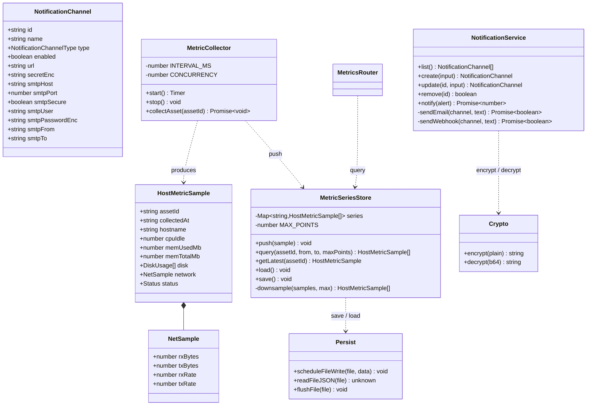
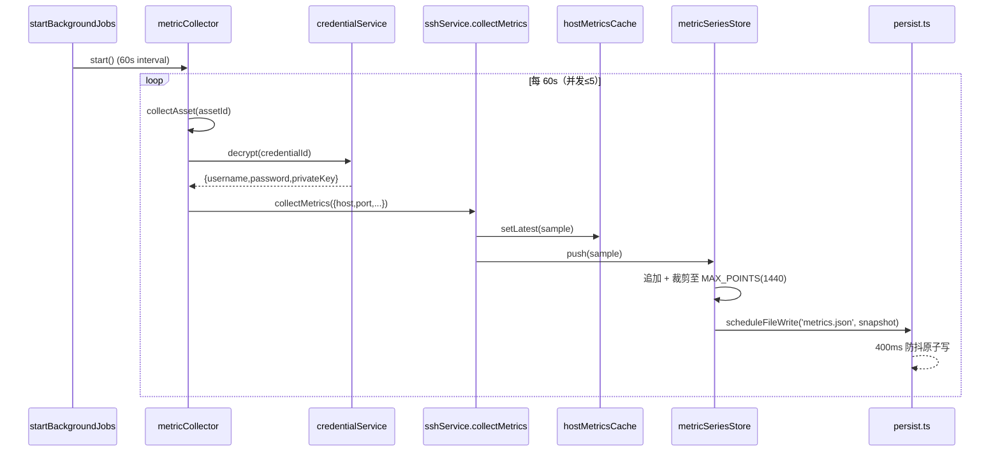
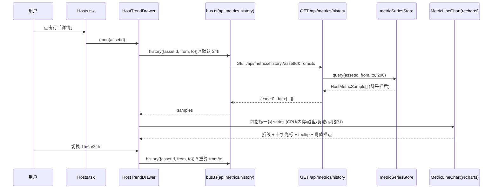
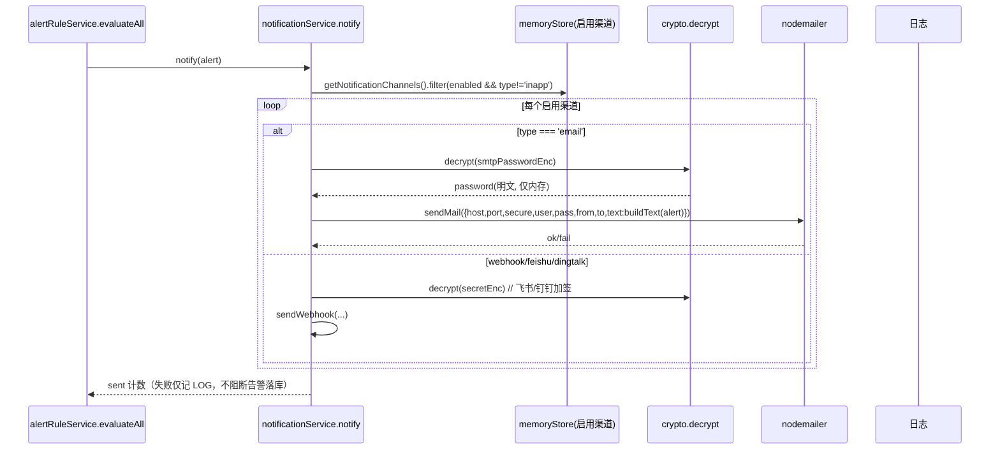
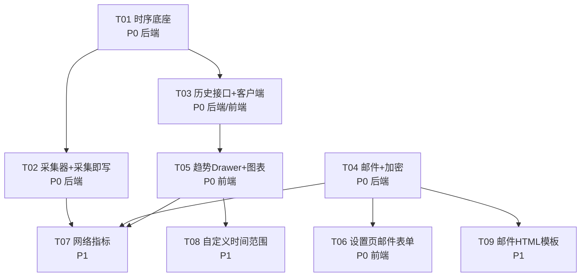

# 架构设计 · 增量 1：主机指标时序化 + 趋势曲线 + 邮件通知（SMTP）

> 产出方：架构师（高见远 / Bob）
> 基线：PRD-增量1、修复实施记录、现有源码（`hostMetricsCache` / `sshService` / `notificationService` / `memoryStore` / `persist` / `types` / `bus` / `index` / `App` / `Settings` / `Hosts` / `crypto` / `response`）
> 范围：**严格遵循主理人 §6 决策**（60s/24h 环形缓冲、图表用 `@mui/x-charts`、nodemailer、网络 P1、纯文本邮件、历史端点 `/api/metrics/history`、webhook secret 加密）
> 本增量已由主理人落地实现并通过验证（前端/后端 tsc 零错误、vite build 通过、冒烟测试 10/10），最终实现见 `docs/增量1实施记录.md`；本文档为设计基线，图表选型以 §8.1 裁定为准。

---

## 1. 实现方案 + 框架选型

### 1.1 总体架构
维持「Electron 壳 + Vite/React 18 渲染进程 + Express 4 能力总线（主进程内）」形态，本增量全部落在**既有分层**内，不引入数据库、不引入 Prometheus/Grafana：
- **存储**：新增 `metricSeriesStore`（内存 `Map<assetId, HostMetricSample[]>`，环形缓冲 1440 点），通过**复用 `persist.ts` 的原子写 + 400ms 防抖**落盘独立的 `metrics.json`（不并入 `store.json`，避免主存储膨胀）。
- **采集**：新增 `metricCollector` 后台任务（挂 `startBackgroundJobs`，默认 60s，并发≤5，SSH 超时 10s），遍历有 `credentialId` 的资产调用抽离出的 `collectAsset(assetId)`；`collectMetrics` 在 `setLatest` 后 `metricSeriesStore.push`。
- **查询**：新增 `GET /api/metrics/history` 路由，按 ISO 范围过滤并对 >200 点做降采样（步长采样，O(n)）。
- **前端**：新增 `MetricLineChart`（图表组件）+ `HostTrendDrawer`（右侧 Drawer），Hosts 页加「详情」入口；`bus.ts` 加 `api.metrics.history` 类型化客户端。
- **邮件**：`NotificationChannel` 增 `email` 类型与 SMTP 字段；`notificationService.notify` 增 SMTP 分支（nodemailer）；`smtpPassword` / `secret` 经 `crypto.ts`（AES-256-GCM）加密落盘为 `smtpPasswordEnc` / `secretEnc`，列表 `mask()` 剥离。

### 1.2 框架选型与体积评估
| 维度 | 选型 | 理由 | 体积影响 |
|---|---|---|---|
| 前端图表 | **@mui/x-charts `LineChart`**（主理人最终裁定，见 §8.1） | `@mui/x-charts@^7.29.1` 已在 `dependencies` 且 Dashboard 已使用；零新增依赖、天然继承 MUI 主题令牌、支持 tooltip/阈值描点 | 零新增（复用现有依赖） |
| 后端 SMTP | **nodemailer** | 纯 JS、无原生编译，规避 Electron 打包原生模块重编译失败风险 | ~很小（纯 JS，含少数依赖）；列入 `dependencies` 并注释 |
| 加密 | **复用现有 `crypto.ts`**（AES-256-GCM + `ops-key.json`） | 与凭据体系完全一致，零新增加密代码 | 无新增依赖 |
| 持久化 | **复用 `persist.ts`**（原子写 + 400ms 防抖） | 不另起 IO 机制，保证一致性与零原生依赖 | 无新增依赖 |
| 图表（已裁定，不再备选 recharts） | 采用 `@mui/x-charts` | recharts 会引入第二个图表库 + ~110KB gz，违背单一依赖/主题一致 | 零新增 |

**明确不引入**：数据库（SQLite/Postgres 等）、Prometheus、Grafana、Tailwind（已清理）、zustand（已清理）。

### 1.3 关键技术难点与对策
1. **环形缓冲裁剪**：`push` 追加后 `if (arr.length > MAX_POINTS) arr.shift()`，单资产内存 ≤ 1440 点。
2. **采集不阻塞总线**：`metricCollector` 用 `setInterval` + `Promise.allSettled` 限并发（≤5），单资产采集失败仅记日志不抛出；SSH 超时沿用 `connectSsh` 默认 10s。
3. **payload 体积**：历史查询 >200 点降采样到 ≤200，单请求 ≤ ~50KB。
4. **加密不泄漏**：`smtpPassword`/`secret` 仅在请求体明文进入，落盘即加密为 `*Enc`，列表/详情接口 `mask()` 剥离密文与明文，日志中绝不出现密码。
5. **类型单一真源**：`NotificationChannel`/`HostMetricSample` 改动全部在 `src/shared/types.ts`，前端 `bus.ts` 与后端 service/route 共用。

---

## 2. 文件列表及相对路径

> 标记：【新】新增文件　【改】修改文件　【关联】间接受影响（无需改代码，类型自动扩展）

### 2.1 后端（主进程 / Express）
| 文件 | 状态 | 改动要点 |
|---|---|---|
| `src/server/store/metricSeriesStore.ts` | 【新】 | 环形缓冲 store：`push / query / getLatest / load / save / downsample`；`MAX_POINTS=1440` |
| `src/server/store/persist.ts` | 【改】 | 新增通用 `scheduleFileWrite(file,data)` + `readFileJSON(file)`（按文件名维护独立防抖计时器）；新增 `flushFile(file)` 供退出前落盘 |
| `src/server/services/metricCollector.ts` | 【新】 | 后台周期采集器：`start()/stop()/collectAsset(assetId)`；抽离 `collectAsset` 单一真源 |
| `src/server/services/sshService.ts` | 【改】 | `collectMetrics` 在 `setLatest` 后 `metricSeriesStore.push`；新增网络采集（P1）：`/proc/net/dev` 取 rx/tx 算速率，`network?` 字段 |
| `src/server/services/notificationService.ts` | 【改】 | 增 `email` 分支（nodemailer 发 `buildText` 纯文本）；`secret`/`smtpPassword` 加密为 `*Enc`；`mask()` 剥离 `*Enc` 与明文；`notify` 遍历启用渠道（含 email）；webhook/飞书/钉钉签名密钥改走 `secretEnc` |
| `src/server/routes/metrics.ts` | 【新】 | `GET /api/metrics/history?assetId&from&to`；参数校验 + 降采样 + 统一信封 |
| `src/server/index.ts` | 【改】 | `app.use('/api/metrics', metricsRouter)`；`startBackgroundJobs` 内 `metricCollector.start()` 并在 `stopBackgroundJobs` 内 `stop()`；退出前 `metricSeriesStore.save()`/flush |
| `src/shared/types.ts` | 【改】 | `NotificationChannelType` 增 `'email'`；`NotificationChannel` 增 `secretEnc?`/`smtpHost?`/`smtpPort?`/`smtpSecure?`/`smtpUser?`/`smtpPasswordEnc?`/`smtpFrom?`/`smtpTo?`；`HostMetricSample` 增 `network?: NetSample`；新增 `NetSample` 接口 |

### 2.2 前端（渲染进程）
| 文件 | 状态 | 改动要点 |
|---|---|---|
| `src/renderer/components/MetricLineChart.tsx` | 【新】 | recharts 折线图：主题色、十字光标、tooltip、阈值描点（≥90 error / ≥75 warning）、面积可选；单一组件便于底层库替换 |
| `src/renderer/components/HostTrendDrawer.tsx` | 【新】 | 右侧 Drawer：主机名+在线 Chip+刷新+关闭；时间范围 `ToggleButtonGroup`(1h/6h/24h)；概览 2 列 `MetricBar`（最新值）；CPU/内存/磁盘/负载/网络(P1) 各一张 `Paper`+`MetricLineChart`；加载/空/错误态齐备 |
| `src/renderer/pages/Hosts.tsx` | 【改】 | 主机列表行加「详情」入口 → 打开 `HostTrendDrawer`；接入 `api.metrics.history`；保留既有采集/终端/删除 |
| `src/renderer/pages/Settings.tsx` | 【改】 | 类型 `MenuItem` 增「邮件」并同步 `TYPE_LABEL`；`email` 表单（SMTP 主机/端口/加密 Switch/用户名/密码/发件人/收件人/启用）；前端校验（必填+邮箱格式+端口数字）；回显（密码留空保留）；失败 `Alert`；字段 1:1 映射 |
| `src/capabilities/bus.ts` | 【改】 | `api.metrics.history({assetId,from,to})` 类型化客户端；`NotificationChannel`/`NotificationChannelType` 类型随 types 自动扩展 |

### 2.3 工程配置
| 文件 | 状态 | 改动要点 |
|---|---|---|
| `package.json` | 【改】 | `dependencies` 增 `recharts@^2`（前端图表，注释体积）、`nodemailer@^6`（后端 SMTP，注释纯 JS 无原生编译）；复核 `@mui/x-charts` 去留（见 §8） |
| `docs/Spec.md` | 【关联】 | 回修订：补 `/api/metrics/history` 端点与 `NotificationChannel`/`HostMetricSample` 新字段（PRD §6.6 要求） |

---

## 3. 数据结构与接口（类图 / 类型）



### 3.1 `metricSeriesStore` 对外接口与存储结构
```ts
// src/server/store/metricSeriesStore.ts
export const MAX_POINTS = 1440 // 24h @ 60s
export interface MetricSeriesStore {
  push(sample: HostMetricSample): void
  query(assetId: string, fromISO: string, toISO: string, maxPoints?: number): HostMetricSample[]
  getLatest(assetId: string): HostMetricSample | undefined // 兜底 hostMetricsCache.getLatest
  load(): void   // 启动读取 metrics.json
  save(): void   // 经 persist.scheduleFileWrite('metrics.json', snapshot) 防抖落盘
}
// 内存结构：Map<assetId, HostMetricSample[]>（按 collectedAt 升序）
// 落盘结构 metrics.json：{ version: 1, series: Record<string, HostMetricSample[]> }
```
- `push`：追加到对应数组末尾，若 `length > MAX_POINTS` 则 `shift()` 裁剪最旧（环形缓冲）。
- `query`：按 `collectedAt` 落在 `[from, to]` 区间过滤；若 `result.length > maxPoints(默认 200)` 调用 `downsample`。
- `downsample`（v1 采用步长采样，适配均匀 60s 节奏，O(n)）：`step = ceil(len/maxPoints)`，取索引 `0, step, 2*step, ...` 并确保包含末点。
- `getLatest`：本 store 取最新；为空时兜底 `hostMetricsCache.getLatest(assetId)`。

### 3.2 `GET /api/metrics/history` 请求 / 响应 schema
```
请求：GET /api/metrics/history?assetId=<必填>&from=<ISO,可选,默认 now-24h>&to=<ISO,可选,默认 now>
  - assetId 缺失/空 → fail(res, 400, 'assetId 必填')
  - from/to 非法 ISO → fail(res, 400, '时间格式错误')
响应信封：{ code:0, data: HostMetricSample[], message:'ok' }
  - 数据 >200 点已降采样；单请求 payload ≤ ~50KB
  - 无数据返回空数组 data:[]
```

### 3.3 `NotificationChannel` 增 `email` 字段 + 加密约定
```ts
// src/shared/types.ts（节选）
export type NotificationChannelType = 'webhook' | 'feishu' | 'dingtalk' | 'inapp' | 'email'

export interface NotificationChannel {
  id: string
  name: string
  type: NotificationChannelType
  enabled: boolean
  createdAt: string
  // —— webhook / 飞书 / 钉钉 ——
  url?: string
  secretEnc?: string        // 加密后的签名密钥（替代原 secret 明文落盘）
  // —— email (SMTP) ——
  smtpHost?: string
  smtpPort?: number         // 默认 465(SSL) / 587(STARTTLS)
  smtpSecure?: boolean      // true=SSL/TLS(465)，false=STARTTLS(587)
  smtpUser?: string
  smtpPasswordEnc?: string  // 加密后的 SMTP 密码（绝不明文落盘）
  smtpFrom?: string         // 可选，默认= smtpUser
  smtpTo?: string           // 逗号分隔收件人
}
```
**加密字段处理约定（安全 P0）**：
- 入站：`create`/`update` 接受明文 `secret` / `smtpPassword`，服务端 `encrypt()` 后存 `secretEnc` / `smtpPasswordEnc`，**绝不保存明文**，`secret`/`smtpPassword` 字段本身不落盘。
- 出站：`list()` / `mask()` 剥离 `secret`、`secretEnc`、`smtpPassword`、`smtpPasswordEnc`；前端永不见明文。
- 发送：`notify` 中对启用渠道按需 `decrypt(secretEnc)` / `decrypt(smtpPasswordEnc)` 取明文，仅用于本次连接，不入日志。
- 兼容旧数据：启动时若读到的 channel 含明文 `secret` 且无 `secretEnc`，做一次迁移 `secretEnc = encrypt(secret)` 并清除 `secret`（见 §8 #4）。

### 3.4 `HostMetricSample` 增 `network?`
```ts
// src/shared/types.ts（节选）
export interface NetSample {
  rxBytes: number  // /proc/net/dev 累计接收字节（全网卡求和）
  txBytes: number  // 累计发送字节
  rxRate: number   // bytes/s（与上一采集差值 / 时间差）
  txRate: number
}
// HostMetricSample 新增：
//   network?: NetSample
```
- 计算：`sshService` 维护模块级 `lastNet: Map<assetId,{rx,tx,t}>`，采集时读 `/proc/net/dev` 求和，算 `rate=(cur-last)/(now-lastT)`；Linux 专属，非 Linux / 解析失败则 `network` 留 `undefined`（前端有数据才显示，P1）。

---

## 4. 程序调用流程（时序图）

### 4.1 后台周期采集 → setLatest → push → 持久化


### 4.2 Hosts Drawer → GET history → recharts 渲染


### 4.3 告警生成 → notify → email(SMTP)


---

## 5. 任务列表（有序、含依赖、P0/P1 / 可拆增量 2）

> 标注：归属（后端/前端）、优先级（P0/P1）、可拆增量 2 项。按实现顺序排列。

| 任务 | 名称 | 归属 | 优先级 | 依赖 | 涉及文件（精确到函数级） |
|---|---|---|---|---|---|
| **T01** | 时序底座：metricSeriesStore + persist 通用文件写入 | 后端 | P0 | 无 | 【新】`metricSeriesStore.ts`：`push/query/getLatest/load/save/downsample`、`MAX_POINTS`、`series` Map；【改】`persist.ts`：`scheduleFileWrite(file,data)`、`readFileJSON(file)`、`flushFile(file)`（按文件名独立防抖） |
| **T02** | 采集即写时序 + 周期采集器 | 后端 | P0（网络 P1） | T01 | 【新】`metricCollector.ts`：`start/stop/collectAsset(assetId)`（抽离凭据解析+collectMetrics 单一真源，并发≤5，复用 SSH 10s 超时）；【改】`sshService.ts`：`collectMetrics` 中 `setLatest` 后调 `metricSeriesStore.push`；【改】`index.ts`：`startBackgroundJobs` 加 `metricCollector.start()`、`stopBackgroundJobs` 加 `stop()`、退出前 `metricSeriesStore.save()` |
| **T03** | 历史查询接口 + 前端客户端 | 后端/前端 | P0 | T01 | 【新】`routes/metrics.ts`：`GET /api/metrics/history`（参数校验+调 `metricSeriesStore.query`+降采样+信封）；【改】`index.ts`：`app.use('/api/metrics', metricsRouter)`；【改】`bus.ts`：`api.metrics.history({assetId,from,to})` 类型化 |
| **T04** | 邮件(SMTP)渠道 + 加密体系（安全 P0） | 后端 | P0 | 无（依赖现有 crypto） | 【改】`types.ts`：`NotificationChannelType` 增 `'email'`、`NotificationChannel` 增 `secretEnc/smtp*` 字段、`HostMetricSample` 增 `network?`/`NetSample`；【改】`notificationService.ts`：`create/update` 加 email 分支 + `secret`/`smtpPassword` 加密为 `*Enc` + `mask()` 剥离 + `notify` 增 `sendEmail`(nodemailer) 与 webhook 签名密钥改走 `secretEnc` |
| **T05** | Hosts 趋势 Drawer + MetricLineChart | 前端 | P0 | T03 | 【新】`MetricLineChart.tsx`：recharts 折线（主题色/十字光标/tooltip/阈值描点）；【新】`HostTrendDrawer.tsx`：Drawer 容器 + ToggleButtonGroup 时间范围 + MetricBar 概览 + 各指标 Paper+图表 + 加载/空/错误态；【改】`Hosts.tsx`：行加「详情」入口接入 Drawer + `api.metrics.history`；【改】`bus.ts`：随 T03 |
| **T06** | 设置页邮件(SMTP)表单（可测验收 AC-S1~S10） | 前端 | P0 | T04 | 【改】`Settings.tsx`：`TYPE_LABEL` 增「邮件」、类型 `MenuItem` 增 `email`、按类型切换表单、`email` SMTP 字段、前端校验（必填+邮箱格式+端口数字）、回显（密码留空保留）、失败 `Alert`、字段 1:1 映射、乐观开关+re-list |
| **T07** | 网络指标采集（P1，脆弱可拆增量 2） | 后端/前端 | P1 | T02、T05 | 【改】`sshService.ts`：新增 `/proc/net/dev` 采集 + `lastNet` 速率缓存（Linux 专属，失败留 undefined）；【改】`types.ts`：`network?`（随 T04 一并）；【改】`HostTrendDrawer.tsx`：有数据时展示网络速率卡 |
| **T08** | 自定义时间范围（P1，可拆增量 2） | 前端 | P1 | T05 | 【改】`HostTrendDrawer.tsx`：除 1h/6h/24h 外支持自定义起止（DatePicker），重算 from/to |
| **T09** | 邮件 HTML 模板（P1 可选，可拆增量 2） | 后端 | P1 | T04 | 【改】`notificationService.ts`：`sendEmail` 增基础 HTML 模板（标题/级别色块/指标摘要），纯文本 `buildText` 为后备（alternatives） |

> **字段对齐（AC-S6）**：`Settings` 表单字段 1:1 映射 `NotificationChannel` 扁平字段 `smtpHost/smtpPort/smtpSecure/smtpUser/smtpPassword/smtpFrom/smtpTo`；列表返回 `mask()` 剥离 `smtpPassword`/`smtpPasswordEnc`；多填/少填字段由后端 `create/update` 严格按白名单写入，拒绝孤儿字段。

### 5.1 任务依赖图


---

## 6. 依赖包列表

| 包 | 版本 | 安装位置 | 理由（Electron 打包规则） | 体积注释（写入 package.json） |
|---|---|---|---|---|
| `@mui/x-charts` | `^7.29.1`（已有，无需新增） | **dependencies** | 主理人最终裁定改用（见 §8.1）：已在 dependencies 且 Dashboard 已使用，零新增依赖、天然继承 MUI 主题 | 无需新增 |
| `nodemailer` | `^6.10.1`（已安装） | **dependencies** | 主进程（Express）运行时依赖，纯 JS 无原生编译；electron-builder 打包 `node_modules`，必须 `dependencies` | `// nodemailer: 后端 SMTP 发信，纯 JS 无原生编译` |
| `@types/nodemailer` | `^6.4.0`（已安装） | **devDependencies** | nodemailer 无内置类型，供 tsc 类型检查 | `// 类型声明` |

**dependencies vs devDependencies 判断**：
- `dependencies` = 应用运行时真正需要的包（主进程 require / 渲染进程经 Vite 打包参与运行）。`nodemailer` 属此类；`@mui/x-charts` 已在此类。
- `devDependencies` = 仅构建/类型检查/打包工具链（`vite`、`typescript`、`electron`、`@types/*`、`electron-builder` 等）。`@types/nodemailer` 属此类。
- ✅ 已裁定：**不引入 recharts**，直接复用 `@mui/x-charts@^7.29.1`（`MetricLineChart.tsx` 封装其 `LineChart`）。

---

## 7. 共享知识（跨文件约定）

1. **字段命名（单一真源）**：所有新增字段定义在 `src/shared/types.ts`；前端 `bus.ts` 与后端 service/route 共用同一类型，禁止在两侧各写一份。
2. **加密约定（复用 `crypto.ts`）**：
   - 密钥：`ops-key.json`（AES-256-GCM），与凭据体系同一把密钥，绝不外发。
   - 落盘形态：`encrypt(plain)` → `base64(iv|tag|cipher)`；敏感字段统一以 `*Enc` 后缀存储（`secretEnc` / `smtpPasswordEnc`）。
   - 列表/详情：统一经 `mask()` 剥离 `secret`/`secretEnc`/`smtpPassword`/`smtpPasswordEnc`，前端永不见明文。
   - 日志：发送失败仅记 `channel 名/类型`，**绝不**把密码/secret 写进日志。
3. **令牌传递（不退化）**：所有变更型接口（`POST/PUT/DELETE` 通知渠道、未来 metric 写接口）沿用 `requireWriteToken` 中间件；终端 WS 仍 `verifyClient` 校验 `token`。本增量新增皆为只读 `GET /api/metrics/history`，亦受 CORS 收紧保护。
4. **错误信封（统一）**：成功 `{code:0,data,message:'ok'}`；失败 `{code:非零,message,detail?}`（HTTP 恒 200，由 `fail()` 产出）；前端 `bus.ts` `request` 在 `code!==0` 抛 `ApiClientError`。
5. **降采样算法（v1）**：`GET /api/metrics/history` 默认 `maxPoints=200`；`count>200` 时 `step=ceil(count/200)`，取索引 `0,step,2*step,…` 并保末点（适配均匀 60s 节奏，O(n)，payload ≤ ~50KB）。后续可升级 LTTB（非阻塞 P2）。
6. **持久化机制（复用）**：`metricSeriesStore` 经 `persist.scheduleFileWrite('metrics.json', snapshot)` 复用原子写+400ms 防抖；与 `store.json` 物理隔离；退出前 `flushFile('metrics.json')` 防丢（在 `main.ts` before-quit 调用）。
7. **环形缓冲裁剪**：`MAX_POINTS=1440`（24h@60s），本期不可调；`push` 超量即 `shift()` 最旧；`metrics.json` 硬上限 20MB，超限启动告警并截断最旧资产序列。
8. **采集并发与超时**：`metricCollector` 并发≤5，`connectSsh` 默认超时 10s（沿用既有），单资产失败仅记日志不抛出，不阻塞 Express 总线。
9. **主题令牌**：前端图表/趋势/Drawer 一律引用 `theme.palette.*`（primary.success/warning/error、divider、background），禁硬编码色值；阈值描点 ≥90→error、≥75→warning、其余→success。
10. **邮件内容**：本期纯文本（复用 `buildText(alert)`）；HTML 模板为 P1 可选（alternatives 后备）。

---

## 8. 待明确事项（需主理人/用户再拍板）

1. **【已裁定 ✅】图表采用 `@mui/x-charts` 的 `LineChart`**：核查确认 `@mui/x-charts@^7.29.1` 已在 `dependencies` 且 `Dashboard.tsx` 已使用（`LineChart`/`PieChart`/`BarChart`），是活跃依赖而非冗余。故**不引入 recharts**，`MetricLineChart.tsx` 封装 `@mui/x-charts` 的 `LineChart`——零新增依赖、天然继承 MUI 主题、体积最优。

2. **邮件发件人默认值**：PRD 写「发件人可选，默认=用户名」。确认 `smtpFrom` 缺省时后端自动填 `smtpUser`，无需前端额外处理。

3. **网络指标 OS 边界**：`/proc/net/dev` 为 Linux 专属。本应用监控目标多为远程 Linux（SSH），但若资产为 Windows 或非 Linux，`network` 应留 `undefined` 且前端隐藏该卡。确认「非 Linux 静默跳过」即满足 P1，不阻塞增量 1；若担心脆弱性，按主理人决策可整体拆到增量 2。

4. **【重要·兼容性】旧数据迁移**：现有已部署实例的 `store.json` 中 webhook/飞书/钉钉 `secret` 为**明文**。升级后首次启动需迁移：`secretEnc = encrypt(secret)` 并清除明文 `secret`（一次性，迁移后写回 `store.json`）。需主理人确认是否在本增量内一并处理（建议是，否则旧渠道加签失效/明文残留）。

5. **降采样策略**：v1 采用步长采样（简单、O(n)、适配均匀节奏）；如需更保真（保留峰谷）可升级 LTTB。请求确认 v1 是否够用（建议够用，先上线）。

6. **`metrics.json` 容量告警阈值**：PRD 给硬上限 20MB。具体「超限截断最旧资产」的实现细节（按资产维度截断还是全局裁剪）请求确认；建议按资产维度 FIFO 截断超阈值部分。

7. **Spec.md 同步修订**：PRD §6.6 要求回头把 `/api/metrics/history` 与新增类型修订进 `docs/Spec.md`（唯一活跃真源）。本增量落地时应同步更新，避免文档漂移。

8. **邮件「测试发送」按钮**：PRD 未要求，但设置页可测验收（AC-S1~S10）未含「发信联通性自测」。是否需增「发送测试邮件」按钮（可选，建议增量 2，避免范围蔓延）。

---

## 9. 质量门禁对齐（DoD 映射）
- **功能**：T01~T06 全过；指标自动周期采集落盘；历史查询正确；邮件真发出；设置 AC-S1~S10 通过。
- **UI/UX**：T05/T06 100% 对齐 design-tokens（主色/状态色/圆角/字体/图标），加载/空/错误态齐备，无破图错位。
- **安全**：`smtpPassword`/`secret` 密文落盘 + 列表脱敏（T04）；写接口令牌保护不退化；无密钥泄漏日志。
- **性能**：历史查询/图表降采样+memo 不卡顿；采集不阻塞总线；`metrics.json` ≤ 20MB（T01/T02 共享知识）。
- **可维护**：类型单一真源、采集逻辑共用（`collectAsset`）、持久化复用 `persist`、新增依赖留痕（T01/T02/T04/§6）。

> 收敛原则：网络指标（T07）因 OS 差异脆弱则拆增量 2；自定义时间范围（T08）、邮件 HTML（T09）同理，不阻塞增量 1 上线。
